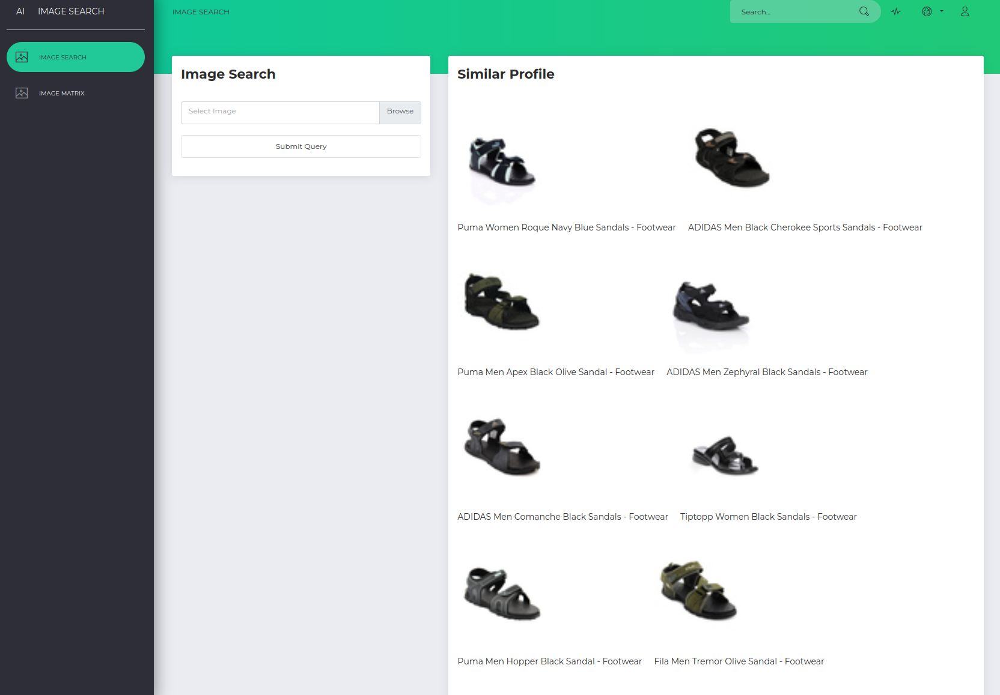

# Image Search
This repository demonstrated multiple packages
- MiniKuber for deployment
- Docker for the container and quickstart
- Flask for the webapp
- Tensorflow for the computer vision



## Quickstart - Local
Run the shell script to run the streamlit app
```
sh streamlit_deploy.sh
```

## Quickstart - MiniKube (K8s)
```
sh kube_deploy.sh
```

## Data Source
https://www.kaggle.com/datasets/paramaggarwal/fashion-product-images-small

## HTML template
Can't find the original template yet
